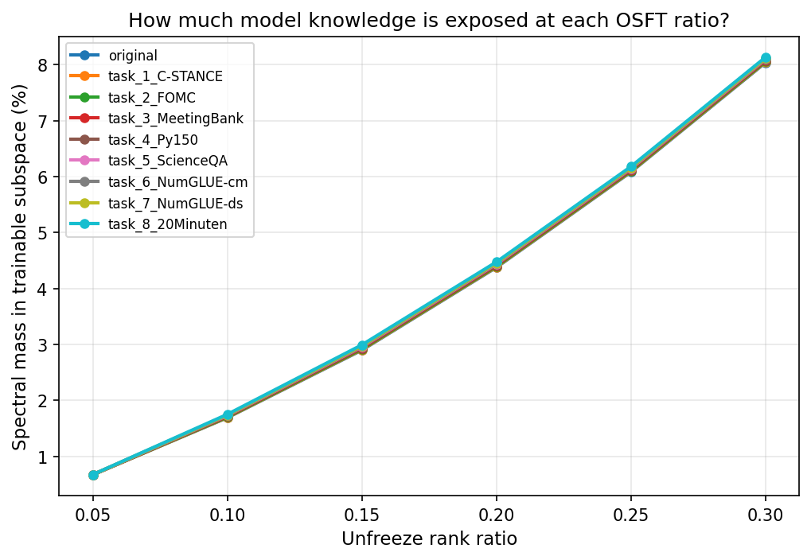
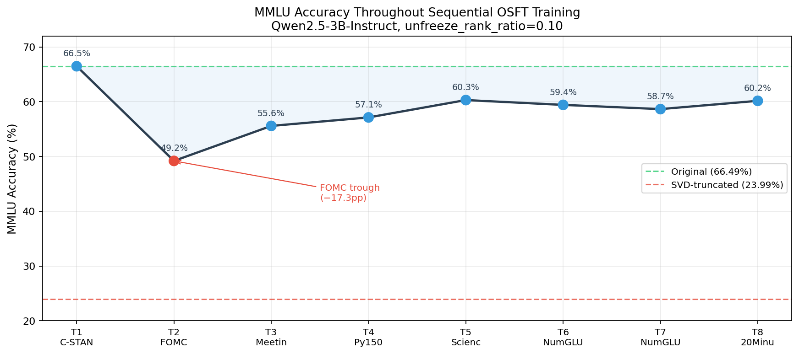
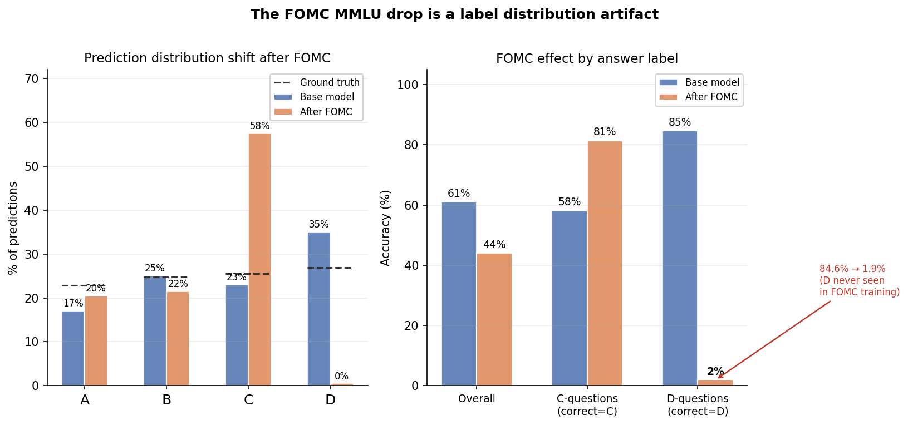
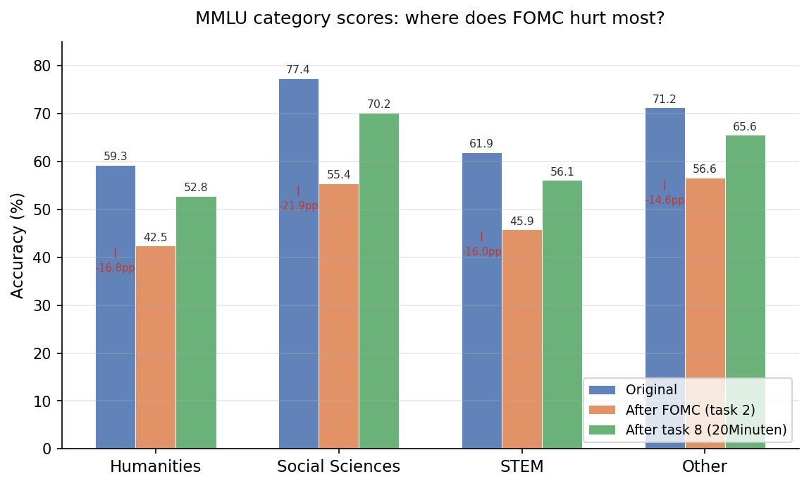
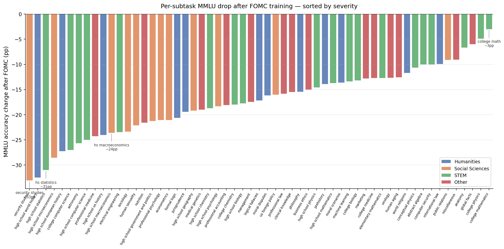
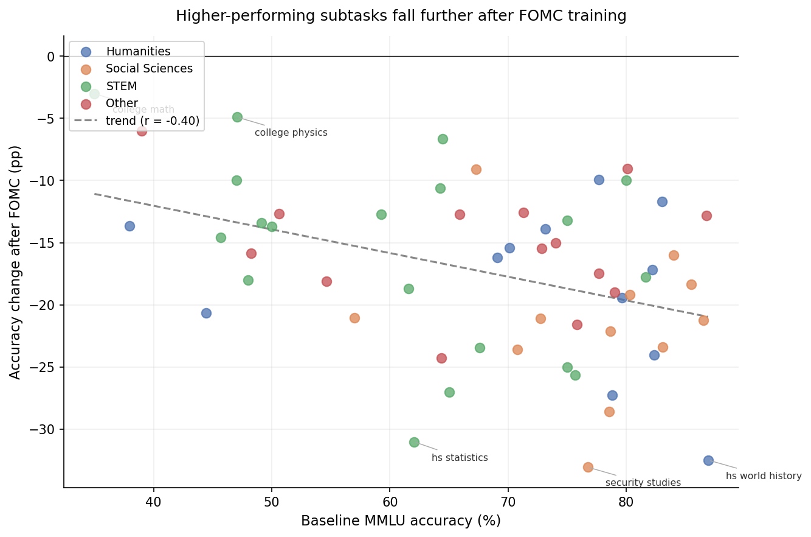
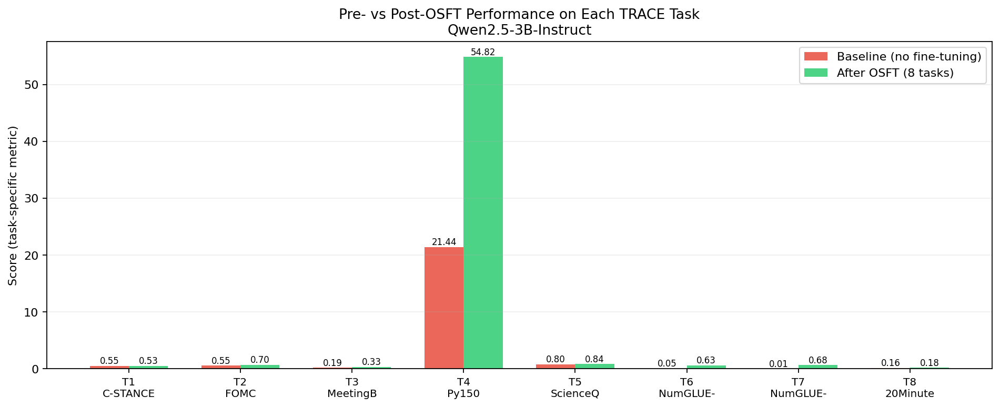
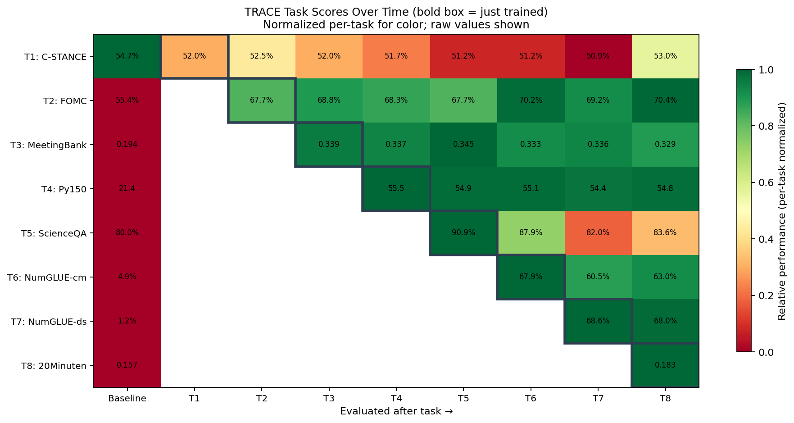
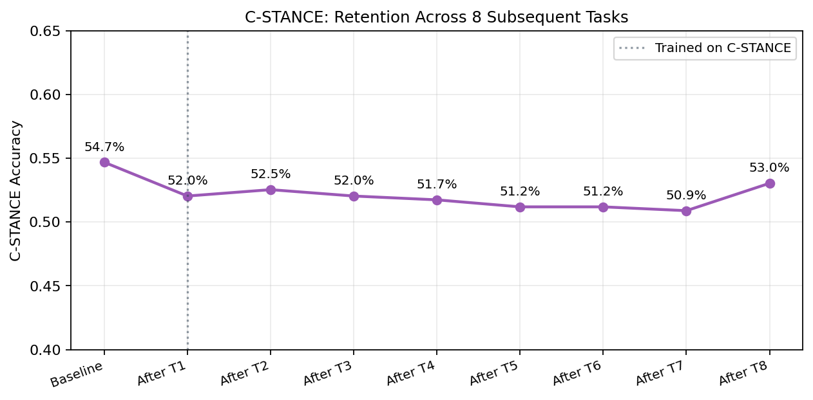

# Teaching a 3B model eight things without forgetting any of them

The classic problem with fine-tuning is that it forgets. You take a pretrained model, train it on task A, and it gets good at task A — but quietly starts failing at everything else. Do it sequentially across multiple tasks and the degradation compounds. This is called **catastrophic forgetting**, and it's a serious obstacle if you want to keep teaching a deployed model new things over time.

The [TRACE benchmark](https://arxiv.org/abs/2310.05792) was designed to measure exactly this. It presents 8 diverse tasks in sequence — stance detection, Fed policy classification, meeting summarisation, Python code completion, science QA, numerical reasoning (twice), and German news summarisation — and asks you to train on all of them without destroying what you learned on the earlier ones.

In this post, I'll walk through an experiment using **Orthogonal Subspace Fine-Tuning (OSFT)** on Qwen2.5-3B-Instruct, covering how I picked the training configuration, what the results actually look like, and a few things that surprised me.

## The approach: OSFT

The idea behind OSFT is simple but clever. Every weight matrix has a singular value decomposition **W = UΣV^T**. The large singular values correspond to the "important" directions — the ones that carry the bulk of the model's representation power. Small singular values correspond to a low-energy subspace that mostly gets ignored during inference.

OSFT's bet: if you restrict all gradient updates to happen in the *small* singular value subspace, you avoid overwriting the knowledge encoded in the dominant directions. New tasks get learned in the leftover space; old tasks stay put in the high-energy subspace that nobody touches.

The single hyperparameter you care about is `r` — the **unfreeze rank ratio**. It controls what fraction of the singular components (from the bottom) are trainable:

- Freeze the top **(1 − r)** fraction
- Allow gradient flow through the bottom **r** fraction

The question is: how do you pick `r`?

## Picking the ratio with spectral analysis

Before running any training, I did an SVD sweep across every weight matrix in Qwen2.5-3B-Instruct to understand how much of the model's total Frobenius norm energy lives in the low-rank subspace at various thresholds. I'll call this **spectral mass**:

$$\text{mass}(r) = \frac{\sum_{i > (1-r)p} \sigma_i^2}{\sum_i \sigma_i^2}$$

| Ratio | Spectral mass |
|-------|--------------|
| 0.05  | 0.67% |
| 0.10  | 1.69% |
| 0.15  | 2.90% |
| 0.20  | 4.38% |
| 0.25  | 6.08% |
| 0.30  | 8.04% |

I initially ran with `r=0.25`, saw catastrophic MMLU degradation, and switched to `r=0.10`. At 0.10, only 1.69% of spectral mass is in the trainable subspace — the model has room to learn but we're not touching anything important.

One thing worth flagging: spectral mass is measuring singular value *magnitudes*. OSFT primarily works by rotating singular *vectors* (U, V), not by changing magnitudes (Σ). So the table above is really telling you "how much capacity are we reserving" — it's a proxy, not a direct readout of what the model learns. I'll come back to this.

## The SVD-truncated baseline

Before fine-tuning anything, I created a sanity-check baseline: a version of Qwen2.5-3B where I *zeroed out* the bottom 10% of each weight matrix's singular components. If those components are noise, performance should be roughly unchanged.

| Model | MMLU (5-shot) |
|-------|--------------|
| Original Qwen2.5-3B | **66.5%** |
| SVD-truncated (bottom 10% zeroed) | **24.0%** |

That's a **−42.5pp** drop from erasing 1.69% of spectral mass. The low-rank subspace is not noise.

This is actually consistent with what [Staats, Thamm & Rosenow (2024)](https://arxiv.org/abs/2410.17770) find in their random matrix analysis of BERT, Pythia, and Llama: small singular values matter — particularly once the model has been fine-tuned — and their corresponding singular vectors substantially overlap with eigenvectors of the activation covariance matrix. In other words, these components are exactly where the model routes task-specific information during inference. Zeroing them out removes that routing.

OSFT doesn't zero these components. It trains *within* them, which is why the model can keep learning without destroying its existing capabilities.

## MMLU trajectory across 8 tasks

I tracked MMLU (5-shot, 57 subtasks) after each OSFT training stage:

A few things stand out:

**FOMC causes a significant trough.** FOMC is a Fed monetary policy classification task where the labels are single characters: A, B, or C. After training on it, MMLU drops from 58.6% to 49.2% — a −9.4pp hit.

After re-training the FOMC checkpoint and running inference on a 200-question MMLU sample, the mechanism becomes concrete. [Nait Saada et al. (2024)](https://arxiv.org/abs/2410.07799) describe rank collapse as tokens converging toward identical representations — here, the output distribution collapses in exactly that sense, just at the label level:

**FOMC is a 3-class task. MMLU is 4-class. The model stops predicting D entirely.**

The FOMC training set contains A, B, and C labels only — D never appears. After fine-tuning, the model assigns near-zero probability to D (0.5% of predictions vs D being the correct answer 26.9% of the time). On questions where the correct answer is D:

| | D-questions accuracy | C-questions accuracy | Overall |
|--|--|--|--|
| Base model | 84.6% | 58.1% | 61.0% |
| After FOMC | **1.9%** | **81.4%** | **44.0%** |

The −17pp overall drop is almost entirely explained by this: the model fails D-questions catastrophically (−82.7pp) while actually *improving* on C-questions (+23.3pp), because C is over-represented in the FOMC training distribution (48.9% of labels vs 25.5% in MMLU).

This also explains the uniform category recovery. Nothing domain-specific was damaged — the model just needed to see D as a valid output label again, which happens naturally during MeetingBank (open-ended generation) and the subsequent tasks.

Breaking the damage down by MMLU category and subtask confirms there's no domain fingerprint:

| Category | Drop after FOMC | Recovery by task 8 | Net |
|----------|----------------|-------------------|-----|
| Humanities | −16.8pp | +10.3pp (61%) | −6.5pp |
| **Social Sciences** | **−22.0pp** | +14.8pp (67%) | −7.2pp |
| STEM | −16.0pp | +10.2pp (64%) | −5.8pp |
| Other | −14.6pp | +9.0pp (62%) | −5.6pp |

Social Sciences takes the biggest hit only because it had the highest baseline accuracy — and the per-subtask scatter confirms this:

The trend (r = −0.40) — stronger subtasks drop more — is explained by the same artifact: high-accuracy subjects had a higher proportion of correct D answers that the model was getting right. After FOMC, it gets all of them wrong. Low-accuracy subjects had weak D performance to begin with, so there's less to lose.

**The model recovers.** By task 5 (ScienceQA), MMLU climbs back to 60.3%. By the end of task 8, it sits at 60.2% — still −6.3pp below the original 66.5%.

## Task performance: baseline vs OSFT

How much did the model actually learn?

| Task | Baseline | After OSFT | Δ |
|------|----------|-----------|---|
| C-STANCE (accuracy) | 54.7% | 52.1% | −2.6pp |
| FOMC (accuracy) | 55.4% | 67.7% | +12.3pp |
| MeetingBank (ROUGE-L) | 19.4% | 33.9% | +14.5pp |
| Py150 (similarity) | 21.4 | 55.5 | +34.1 |
| ScienceQA (accuracy) | 80.0% | 90.9% | +10.9pp |
| NumGLUE-cm (accuracy) | 4.9% | 67.9% | +63.0pp |
| NumGLUE-ds (accuracy) | 1.2% | 68.6% | +67.4pp |
| 20Minuten (ROUGE-L) | 15.7% | 18.3% | +2.6pp |

The NumGLUE tasks are the most dramatic. The base model was essentially guessing (1–5%), and OSFT fine-tuning brought both to ~68%. ScienceQA improved from a strong 80% baseline to 91%.

C-STANCE is the only regression at −2.6pp, but as we'll see next, it holds that score well through all subsequent training.

## Catastrophic forgetting: the full picture

This is the real test. After training on later tasks, how much does the model forget the earlier ones?

Each row is a task; each column is a point in time (right after training on that task). The diagonal is performance immediately after fine-tuning. Off-diagonal entries show how much survives as more tasks are piled on top.

A few things worth highlighting:

**C-STANCE holds up across all 8 tasks.** It starts at 52.1% after task 1 and ends at 53.1% after task 8 — seven more training stages, essentially zero forgetting. This is OSFT doing its job: subsequent updates can't touch what's encoded in the high-energy subspace.

**FOMC actually improves over time.** It scores 67.7% right after task 2 training, and drifts up to 70.4% by task 8. This is unexpected — later tasks seem to *refine* the FOMC representation rather than overwrite it.

**MeetingBank and NumGLUE are stable once learned.** No meaningful degradation after their respective training stages.

## C-STANCE retention in detail

C-STANCE being task 1 makes it the harshest test: everything gets trained on top of it.

The score stays within ±2pp of its initial value the entire time. The orthogonal subspace constraint is doing exactly what it promises.

## A caveat on the spectral analysis

I tracked spectral mass at each checkpoint to see how much energy accumulated in the low-rank subspace as the model learned:

| Checkpoint | mass@0.10 | mass@0.20 | mass@0.30 |
|-----------|-----------|-----------|-----------|
| original | 1.69% | 4.38% | 8.04% |
| after task 1 (C-STANCE) | 1.70% | 4.39% | 8.05% |
| after task 4 (Py150) | 1.72% | 4.43% | 8.09% |
| after task 8 (20Minuten) | 1.75% | 4.48% | 8.14% |

It barely moves — and I think that's actually the right read. Spectral mass is tracking how much energy we're adding to the low-rank subspace, which corresponds to how much new knowledge we're encoding in it. The answer is: not much. OSFT makes small, targeted updates by design, and 8 sequential fine-tuning tasks don't radically alter the weight matrices — they nudge them. The 1.69% → 1.75% shift over the full experiment is consistent with that picture.

What the metric *can't* tell you is where within that subspace the learning happened — spectral mass is blind to which directions the singular vectors rotated into. But as a coarse indicator of "how much did we disturb the low-rank subspace", it's doing its job.

## What worked and what didn't

**Worked well:**
- Preserving earlier tasks through later training — C-STANCE retention is near-perfect, FOMC actually improves
- Large gains on near-zero baseline tasks (NumGLUE, Py150)
- MMLU recovery after the FOMC trough

**Didn't work as well:**
- MMLU never fully recovers to the original 66.5% — whether that's fundamental to OSFT or a training budget issue, I don't know
- 20Minuten only improved by +2.6pp ROUGE-L, despite being the last task with no forgetting pressure
- Watch out for tasks whose label space is a strict subset of your evaluation benchmark — the FOMC/MMLU issue (A/B/C training vs A/B/C/D eval) caused a mechanical 17pp MMLU drop entirely unrelated to knowledge loss

**Open questions:**
- The SVD-truncated model dropping 42.5pp despite holding only 1.69% of spectral mass suggests these components encode more than their energy would imply. What exactly? The overlap with activation covariance eigenvectors [Staats et al.](https://arxiv.org/abs/2410.17770) identified is a strong lead.
- FOMC's recovery was driven by re-exposure to D-labeled outputs in later tasks. But the model still ends up −6.3pp below baseline on MMLU overall — is that residual gap also label-distribution related, or genuine capability loss?

## Setup

- **Model**: Qwen/Qwen2.5-3B-Instruct
- **OSFT ratio**: 0.10 (bottom 10% of singular components per weight matrix)
- **Training**: 3 epochs per task, cosine LR schedule, peak LR 2e-4, batch size 128
- **Evaluation**: MMLU 5-shot via lm-evaluation-harness; custom inference script for TRACE tasks
- **Hardware**: Single GPU

All experiment code is in [mini_trainer](https://github.com/maciejkozik3/mini-trainer).

## References

- Baijiong Lin et al. (2023). **TRACE: A Comprehensive Benchmark for Continual Learning in Large Language Models.** [arXiv:2310.05792](https://arxiv.org/abs/2310.05792).
- Max Staats, Matthias Thamm & Bernd Rosenow (2024). **Small Singular Values Matter: A Random Matrix Analysis of Transformer Models.** [arXiv:2410.17770](https://arxiv.org/abs/2410.17770).
- Thiziri Nait Saada, Alireza Naderi & Jared Tanner (2024). **Mind the Gap: a Spectral Analysis of Rank Collapse and Signal Propagation in Attention Layers.** [arXiv:2410.07799](https://arxiv.org/abs/2410.07799).
